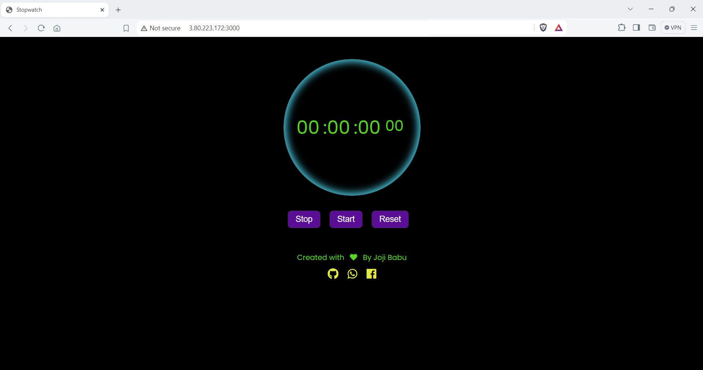

# Stop Watch
* First clone this Resopository 
* In the GitHub in this repository add secrete file in `Settings-->Secrets and variables --> actions -->Repository secrets --> New repository secret` add the secrets like 
    1. `AWS_ACCESS_KEY_ID`
    2. `AWS_SECRET_ACCESS_KEY`
    3. `DOCKER_USERNAME`
    4. `DOCKER_PASSWORD`
* Go to `terraform --> main.tf --> in 22 line change docker password and docker username in the command`

* Then push the code to the repository, automatically GitHub action will perform the task for you

* Take the public ip address of the instance and open `http://<public-ip>:300` in the browser it will open a webpage
* If you can see any webpage go to security groups in aws specified region here `us-east-1 : northen virginia` 
* In that select the security group that is attached to the ec2 instance add an inbound rule   `custome port` 3000 allow it from `o.o.o.o` then you can access a website

* we can install prometheous & Grafana on other instace